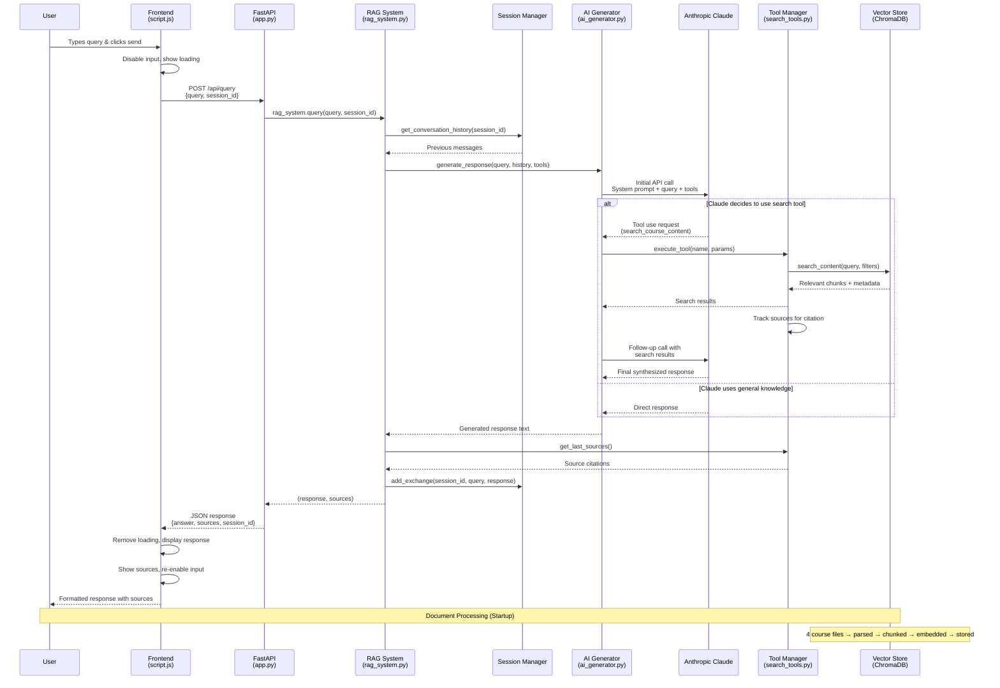

# RAG System Request Flow Diagram

## Component Responsibilities

### Frontend Layer
- **User Interface**: Input handling, loading states, message display
- **Session Management**: Tracks session ID across requests
- **Error Handling**: Network failures, API errors

### API Layer  
- **Request Routing**: FastAPI endpoints (`/api/query`, `/api/courses`)
- **Response Formatting**: Structured JSON responses
- **Error Handling**: HTTP status codes, exception handling

### RAG Orchestration
- **Component Coordination**: Manages all system components
- **Query Processing**: Formats prompts for AI
- **Response Assembly**: Combines AI output with sources

### AI Generation
- **Claude Integration**: Anthropic API calls with tools
- **Tool Orchestration**: Manages tool execution flow
- **Context Management**: Handles conversation history

### Search & Storage
- **Semantic Search**: Vector similarity matching
- **Source Tracking**: Citation management
- **Data Persistence**: ChromaDB vector storage

### Session Management
- **Conversation History**: Multi-turn dialogue support
- **Context Preservation**: Maintains conversational flow

## Key Data Transformations

1. **User Query** → API Request JSON
2. **Text Documents** → Chunked + Embedded Vectors  
3. **Search Query** → Vector Similarity Results
4. **Raw Results** → Contextualized Prompt
5. **AI Response** → Formatted Frontend Display